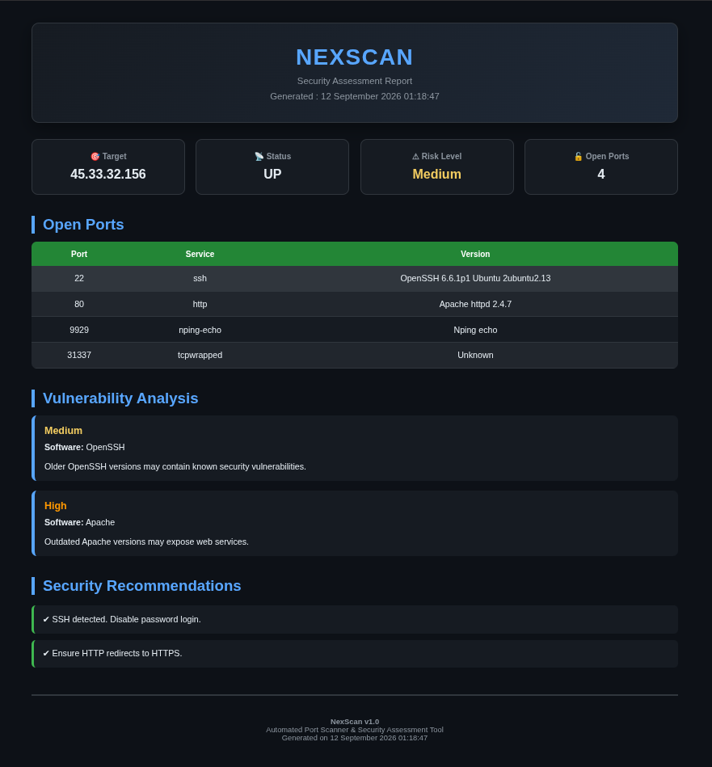

# NexScan

NexScan is a lightweight network reconnaissance and vulnerability assessment tool built in Python.

It performs service discovery using Nmap, analyzes detected services for common security risks, calculates a risk score, generates remediation recommendations, and exports a professional HTML report.

---

## Features

- Port Scanning
- Service & Version Detection
- Risk Score Calculation
- Vulnerability Analysis
- Security Recommendations
- HTML Report Generation
- Automated dependency/setup script

---

## Screenshots


## Installation & Usage demo


---

## Requirements

- Python 3
- Nmap

---

## Project Structure

```
NexScan/
├── banner.py
├── scanner.py
├── parser.py
├── vuln.py
├── report.py
├── risk.py
├── recommendations.py
├── nexscan.py
├── exports/
├── scans/
└── README.md
```

---

## Responsible Use

NexScan is intended for authorized security testing, research, and educational use.

Only scan systems that you own or have explicit permission to test. Users are responsible for ensuring that their use of NexScan complies with applicable laws, regulations, and authorization requirements.

The developers assume no responsibility for unauthorized or unlawful use of this software.

For demonstration purposes, this project uses `scanme.nmap.org`, which is provided by the Nmap Project for authorized Nmap scanning. Do not use it for exploitation, denial-of-service testing, or excessive scanning.

---

## License

This project is licensed under the MIT License. See the [LICENSE](LICENSE) file for details.

---

<p align="center">
  <b>NexScan</b><br>
  Lightweight Network Reconnaissance & Security Assessment
</p>