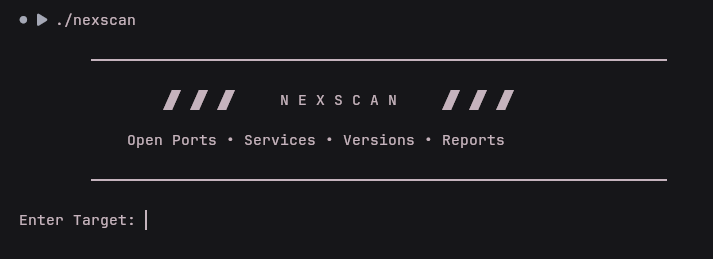

# NexScan

NexScan is a lightweight CLI-based network reconnaissance and security assessment tool built in Python.

It combines Nmap-based port and service discovery with risk assessment, vulnerability analysis, security recommendations, and HTML report generation.

---

## Features

- Port Scanning
- Service & Version Detection
- Risk Score Calculation
- Vulnerability Analysis
- Security Recommendations
- HTML Report Generation
- Automated dependency/setup script

---

## Installation & Usage demo


Clone the repository
```bash
git clone <REPOSITORY_URL>
cd Nexscan
```

Run the autoamted setup with proper execute permission
```bash
chmod +x install.sh
./install.sh
```

The installer checks the required dependencies, installs missing components, creates an isloated python environment, and prepares the Nexscan launcher.


### Usage

Start NexScan:

```bash
./nexscan
```


Enter IP or hostname of a system you are authorized to scan.
```bash
Example: 
scanme.nmap.org
```


---

## Requirements

- Python 3
- Nmap

---

## Project Structure

```
NexScan/
├── banner.py
├── scanner.py
├── parser.py
├── vuln.py
├── report.py
├── risk.py
├── recommendations.py
├── nexscan.py
├── exports/
├── scans/
└── README.md
```

---

## Screenshots


---

## Responsible Use

NexScan is intended for authorized security testing, research, and educational use.

Only scan systems that you own or have explicit permission to test. Users are responsible for ensuring that their use of NexScan complies with applicable laws, regulations, and authorization requirements.

The developers assume no responsibility for unauthorized or unlawful use of this software.

For demonstration purposes, this project uses `scanme.nmap.org`, which is provided by the Nmap Project for authorized Nmap scanning. Do not use it for exploitation, denial-of-service testing, or excessive scanning.

---

## License

This project is licensed under the MIT License. See the [LICENSE](LICENSE) file for details.

---

<p align="center">
  <b>NexScan</b><br>
  Lightweight Network Reconnaissance & Security Assessment
</p>
